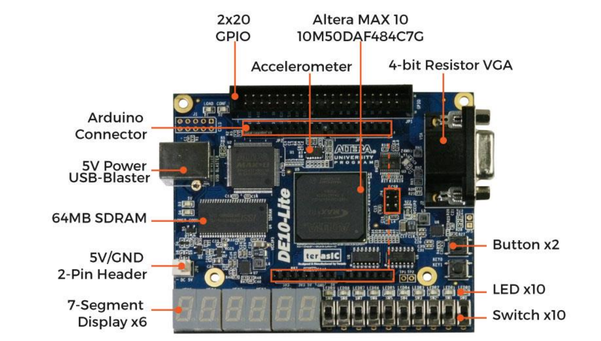

# Architecture Processors
In the "Processor Architecture" repository, several projects have been developed. One of them is the " Multidrop Bus 4-bit," which is used in various applications to establish efficient communication between devices, using a limited number of connection lines. Another module present in the repository is the "Public_Scrolling_Automatic," which automatically displays and scrolls messages. Additionally, the "Public_Kevin" module has been created, which required the implementation of a switch to generate a clock signal in the project. This switch controls the flow of pulses and ensures the proper functioning of the module.

These modules are part of the projects available in the repository and have been developed with the aim of demonstrating practical applications related to processor architecture.

To carry out these projects, the Quartus program and the 10M50DAF484 FPGA model have been used, as shown in the following image:

  

If you would like to obtain more details about these projects, I invite you to explore the repository and consult the provided documentation and schematic diagrams, which will provide you with a more comprehensive understanding of their operation.

Below, you will find some videos showcasing the functionality of the "Public_Scrolling_Automatic" and "Public_Kevin" modules, both in automatic and manual modes

https://github.com/Kevin-Vivas/Arquitectura_Procesadores_GIT/assets/113124011/0ba09131-e283-414f-b431-5ad9f706bc10

- [Public_Kevin](https://github.com/Kevin-Vivas/Arquitectura_Procesadores_GIT/tree/master/Public_Kevin/Public_HDL)

- [Public_Kevin_Schematic_Diagram](https://github.com/Kevin-Vivas/Arquitectura_Procesadores_GIT/blob/master/Public_Kevin/PUBLIC-HDL.pdf)

https://github.com/Kevin-Vivas/Arquitectura_Procesadores_GIT/assets/113124011/7390ec7e-58ac-4fc5-9fb5-7d55ecd6b86a

- [Public_Scrolling_Automatic](https://github.com/Kevin-Vivas/Arquitectura_Procesadores_GIT/tree/master/Public_Scrolling_Automatic)
- [Public_Scrolling_Automatic_Schematic_Diagram](https://github.com/Kevin-Vivas/Arquitectura_Procesadores_GIT/tree/master/Public_Scrolling_Automatic/Schematic_Diagram)

# Multidrop Bus 4-bit
- [Multidrop_Bus_4-bit](https://github.com/Kevin-Vivas/Arquitectura_Procesadores_GIT/tree/master/Multi_Drop_Bus_4Bit/Multi_Drop_Bus)
- [Multidrop_Bus_4-bit_Schematic_Diagram](https://github.com/Kevin-Vivas/Arquitectura_Procesadores_GIT/tree/master/Multi_Drop_Bus_4Bit/Digrama_Excel)

# Recommended_books
[1] [Introduction to Logic Circuits & Logic Design with Verilog](https://link.springer.com/book/10.1007/978-3-030-13605-5)

[2] [Quick Start Guide to Verilog](https://link.springer.com/book/10.1007/978-3-030-10552-5)

[3] [User Manual 10M50DAF484C7G]()

# 💰 **You can help me by Donating**
 

